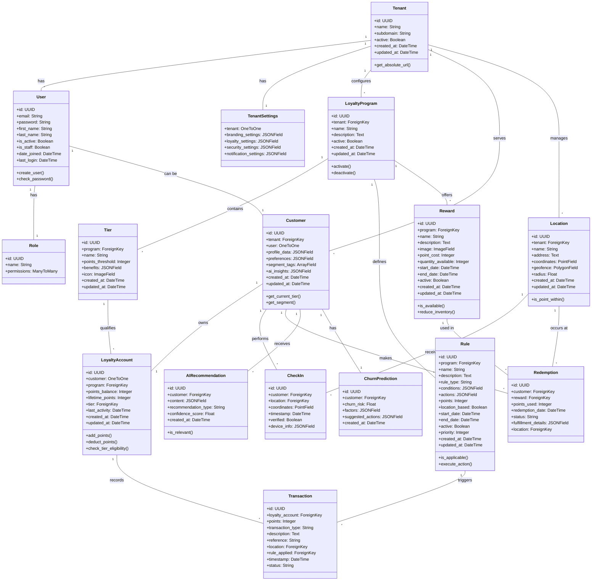

# LoyaltyAI System Architecture

## Implementation Approach

Based on the PRD requirements, we will build a scalable, secure, and maintainable AI-driven location-based loyalty system using Django framework with TailwindCSS for the frontend. The system architecture will focus on:

1. **Modularity**: Breaking down the system into separate Django apps for better code organization and maintainability.
2. **Scalability**: Designing database schema and API endpoints that can handle multiple tenants and growing user bases.
3. **Security**: Implementing robust authentication, authorization, encryption, and fraud prevention.
4. **AI Integration**: Leveraging OpenAI pre-trained models via the requests library for personalization, churn prediction, and intelligent insights.
5. **Location Intelligence**: Utilizing GeoDjango for location-based features.

### Technology Stack

- **Backend**: Django 5.0+
- **Frontend**: TailwindCSS, HTML, JavaScript/TypeScript
- **Database**: PostgreSQL with PostGIS extension for geospatial capabilities
- **AI Integration**: OpenAI API via Python requests library
- **Authentication**: Django authentication with JWT (JSON Web Tokens)
- **Caching**: Redis for performance optimization
- **API**: Django REST Framework for RESTful endpoint creation

## Django Framework Structure

### Project Structure

```
loyalty_system/
├── config/                 # Project configuration
│   ├── settings/
│   │   ├── base.py
│   │   ├── development.py
│   │   └── production.py
│   ├── urls.py
│   └── wsgi.py
├── apps/
│   ├── accounts/           # User authentication & authorization
│   ├── tenants/            # Multi-tenancy management
│   ├── loyalty/            # Core loyalty engine
│   ├── customers/          # Customer profiles & wallets
│   ├── locations/          # Location-based services
│   ├── rewards/            # Rewards & redemption
│   ├── analytics/          # Reporting & insights
│   └── ai_services/        # OpenAI integration
├── templates/              # Shared templates
├── static/                 # Static files (CSS, JS)
│   ├── css/
│   └── js/
├── media/                  # User uploaded files
└── utils/                  # Shared utilities
```

### Apps Description

#### 1. Accounts App
Handles user authentication, authorization, and role-based access control.
- Models: `User`, `Role`, `Permission`
- Views: Login, logout, password reset, profile management
- URLs: `/auth/login/`, `/auth/logout/`, `/auth/password/reset/`

#### 2. Tenants App
Manages the multi-tenant architecture of the system.
- Models: `Tenant`, `TenantSettings`, `Subscription`
- Views: Tenant creation, configuration, management
- URLs: `/admin/tenants/`

#### 3. Loyalty App
Core logic for the loyalty program engine.
- Models: `LoyaltyProgram`, `Rule`, `Transaction`, `Tier`
- Views: Program configuration, rule management
- URLs: `/api/admin/programs/`, `/api/admin/rules/`

#### 4. Customers App
Manages customer profiles, wallets, and engagement.
- Models: `Customer`, `LoyaltyAccount`, `Preference`, `Segment`
- Views: Customer management, point balance, transaction history
- URLs: `/api/customers/`, `/api/points/`

#### 5. Locations App
Handles location-based services and check-ins.
- Models: `Location`, `CheckIn`, `GeofenceEvent`
- Views: Location management, check-in processing
- URLs: `/api/locations/`, `/api/checkin/`

#### 6. Rewards App
Manages rewards catalog and redemption processes.
- Models: `Reward`, `Redemption`, `RewardCategory`
- Views: Reward management, redemption processing
- URLs: `/api/rewards/`, `/api/redemptions/`

#### 7. Analytics App
Provides reporting and business intelligence.
- Models: `Report`, `Dashboard`, `Metric`
- Views: Analytics dashboard, report generation
- URLs: `/api/admin/analytics/`, `/api/admin/reports/`

#### 8. AI Services App
Handles integration with OpenAI for AI-powered features.
- Models: `AIModel`, `Recommendation`, `ChurnPrediction`
- Views: AI insights, recommendation generation
- URLs: `/api/recommendations/`, `/api/admin/insights/`

## Database Schema Design

The database schema is designed to support multi-tenancy, with careful attention to relationships between entities to maintain data isolation between tenants.

### Core Database Models



## API Design

We'll use Django REST Framework to create a comprehensive RESTful API that serves both the customer-facing interface and admin dashboard.

### API Endpoints Structure

#### Authentication Endpoints
- `POST /api/auth/login/` - User login
- `POST /api/auth/logout/` - User logout
- `POST /api/auth/register/` - User registration
- `POST /api/auth/password/reset/` - Password reset request
- `POST /api/auth/password/reset/confirm/` - Password reset confirmation
- `GET /api/auth/user/` - Get current user details

#### Customer-Facing Endpoints
- `GET /api/profile/` - Get customer profile
- `PATCH /api/profile/` - Update customer profile
- `GET /api/points/balance/` - Get current points balance
- `GET /api/points/history/` - Get point transaction history
- `GET /api/rewards/` - List available rewards
- `GET /api/rewards/{id}/` - Get reward details
- `POST /api/rewards/{id}/redeem/` - Redeem a reward
- `GET /api/redemptions/` - List customer redemptions
- `POST /api/checkin/` - Submit location check-in
- `GET /api/recommendations/` - Get personalized recommendations
- `GET /api/tiers/` - List loyalty tiers
- `GET /api/tiers/current/` - Get customer's current tier

#### Admin Endpoints
- `GET /api/admin/tenants/` - List tenants (super admin only)
- `POST /api/admin/tenants/` - Create tenant (super admin only)
- `GET /api/admin/tenants/{id}/` - Get tenant details
- `PATCH /api/admin/tenants/{id}/` - Update tenant

- `GET /api/admin/programs/` - List loyalty programs
- `POST /api/admin/programs/` - Create loyalty program
- `GET /api/admin/programs/{id}/` - Get program details
- `PATCH /api/admin/programs/{id}/` - Update program

- `GET /api/admin/rules/` - List rules
- `POST /api/admin/rules/` - Create rule
- `GET /api/admin/rules/{id}/` - Get rule details
- `PATCH /api/admin/rules/{id}/` - Update rule

- `GET /api/admin/customers/` - List customers
- `GET /api/admin/customers/{id}/` - Get customer details
- `PATCH /api/admin/customers/{id}/` - Update customer
- `POST /api/admin/customers/{id}/adjust-points/` - Adjust customer points

- `GET /api/admin/locations/` - List locations
- `POST /api/admin/locations/` - Create location
- `GET /api/admin/locations/{id}/` - Get location details
- `PATCH /api/admin/locations/{id}/` - Update location

- `GET /api/admin/rewards/` - List rewards
- `POST /api/admin/rewards/` - Create reward
- `GET /api/admin/rewards/{id}/` - Get reward details
- `PATCH /api/admin/rewards/{id}/` - Update reward

- `GET /api/admin/analytics/overview/` - Get analytics overview
- `GET /api/admin/analytics/engagement/` - Get engagement metrics
- `GET /api/admin/analytics/redemptions/` - Get redemption metrics

- `GET /api/admin/insights/segments/` - Get customer segmentation insights
- `GET /api/admin/insights/churn/` - Get churn predictions
- `GET /api/admin/insights/locations/` - Get location-based insights
- `GET /api/admin/insights/feedback/` - Get feedback analysis

### API Authentication & Security

- All API endpoints will be secured with JWT authentication
- Token-based authentication with appropriate expiration times
- Role-based access control to restrict endpoint access
- CORS configuration to control which domains can access the API
- Rate limiting to prevent abuse
- Request/response validation to ensure data integrity
- Encryption of sensitive data in transit (HTTPS)

## OpenAI API Integration

The `ai_services` app will handle all OpenAI API integrations through a well-designed service layer. This abstraction will allow us to maintain, update, and scale AI services independently of other system components.

### OpenAI Service Architecture

```python
class OpenAIService:
    def __init__(self, api_key, model="gpt-4"):
        self.api_key = api_key
        self.model = model
        self.base_url = "https://api.openai.com/v1"
        
    def generate_recommendation(self, customer_data):
        # Process customer data and generate personalized recommendations
        
    def predict_churn(self, customer_activity):
        # Analyze customer activity patterns to predict churn risk
        
    def segment_customers(self, customers_data):
        # Use customer behavior data to create meaningful segments
        
    def analyze_feedback(self, feedback_text):
        # Process customer feedback to extract sentiment and insights
        
    def generate_location_insights(self, location_data):
        # Analyze location patterns to suggest targeted campaigns
```

### Key AI Integration Points

1. **Customer Segmentation**
   - Collect customer transaction history, demographics, and behavior
   - Send aggregated data to OpenAI for pattern identification
   - Store resulting segments in the Customer model for targeted campaigns

2. **Churn Prediction**
   - Analyze customer engagement patterns, frequency, and recency
   - Generate churn risk scores and factors
   - Store predictions in ChurnPrediction model
   - Trigger automated retention workflows for high-risk customers

3. **Personalized Recommendations**
   - Combine customer preferences, history, and current location
   - Generate contextually relevant reward recommendations
   - Deliver through API to customer interface
   - Track recommendation effectiveness

4. **Feedback Analysis**
   - Collect customer feedback from various touchpoints
   - Process through OpenAI for sentiment analysis and key insights
   - Summarize feedback themes for business admins

5. **Location Intelligence**
   - Analyze check-in patterns and location effectiveness
   - Generate insights on optimal promotion placement
   - Recommend location-specific campaign strategies

### Example OpenAI API Call

```python
import requests
import json

def get_personalized_recommendation(customer):
    """Generate personalized recommendations for a customer using OpenAI."""
    
    # Prepare customer context
    context = {
        "purchase_history": customer.get_recent_transactions(limit=10),
        "current_tier": customer.get_current_tier().name,
        "points_balance": customer.loyalty_account.points_balance,
        "redemption_history": customer.get_recent_redemptions(limit=5),
        "preferences": customer.preferences,
        "location": customer.get_current_location()
    }
    
    # Prepare prompt for OpenAI
    prompt = f"""
    Based on the following customer data, suggest 3 personalized reward recommendations 
    that would most likely engage this customer. For each recommendation, provide a 
    brief explanation of why it's suitable for this specific customer.
    
    Customer data:
    {json.dumps(context, indent=2)}
    
    Provide recommendations in JSON format with the following structure:
    [
      {{"title": "Recommendation title", "description": "Brief description", "points_required": 100, "reasoning": "Why this is recommended"}}
    ]
    """
    
    # Make API request to OpenAI
    response = requests.post(
        "https://api.openai.com/v1/chat/completions",
        headers={
            "Authorization": f"Bearer {settings.OPENAI_API_KEY}",
            "Content-Type": "application/json"
        },
        json={
            "model": "gpt-4",
            "messages": [{"role": "system", "content": "You are a loyalty program AI assistant that provides personalized recommendations."}, 
                         {"role": "user", "content": prompt}],
            "temperature": 0.7
        }
    )
    
    # Process response
    if response.status_code == 200:
        try:
            content = response.json()["choices"][0]["message"]["content"]
            recommendations = json.loads(content)
            return recommendations
        except (json.JSONDecodeError, KeyError, IndexError) as e:
            # Handle parsing errors
            logger.error(f"Error parsing OpenAI response: {e}")
            return []
    else:
        # Handle API errors
        logger.error(f"OpenAI API error: {response.status_code} - {response.text}")
        return []
```

## Frontend Integration with TailwindCSS

TailwindCSS will be integrated into the Django templates to create a responsive, modern UI for both customer-facing interfaces and admin dashboards.

### TailwindCSS Setup

1. **Installation and Configuration**
   - Install TailwindCSS via npm
   - Configure tailwind.config.js for customization
   - Set up PostCSS for processing

2. **Django Integration**
   - Include compiled TailwindCSS in the base template
   - Create a build process to optimize for production

### Template Structure

```
templates/
├── base.html               # Base template with common elements
├── auth/                   # Authentication templates
├── customer/               # Customer-facing templates
│   ├── dashboard.html      # Customer dashboard
│   ├── rewards.html        # Rewards catalog
│   ├── points_history.html # Points transaction history
│   ├── profile.html        # Customer profile management
│   └── map.html            # Location-based offers map
├── admin/                  # Admin dashboard templates
│   ├── dashboard.html      # Admin overview
│   ├── programs.html       # Loyalty program management
│   ├── customers.html      # Customer management
│   ├── rules.html          # Rules configuration
│   ├── rewards.html        # Rewards management
│   ├── locations.html      # Location management
│   ├── insights.html       # AI insights
│   └── analytics.html      # Analytics dashboard
└── components/             # Reusable UI components
    ├── header.html
    ├── footer.html
    ├── sidebar.html
    ├── card.html
    ├── modal.html
    ├── form.html
    └── alert.html
```

### Example Base Template with TailwindCSS

```html
<!DOCTYPE html>
<html lang="en">
<head>
    <meta charset="UTF-8">
    <meta name="viewport" content="width=device-width, initial-scale=1.0">
    <title>LoyaltyAI</title>
    
    <!-- TailwindCSS -->
    <link href="" rel="stylesheet">
    
    <!-- Custom CSS -->
    
</head>
<body class="bg-gray-100 min-h-screen">
    <!-- Header -->
    
    
    <!-- Sidebar -->
    
        
    
    
    <!-- Main Content -->
    <main class="container mx-auto px-4 py-8">
        
    </main>
    
    <!-- Footer -->
    
    
    <!-- JavaScript -->
    <script src=""></script>
    
</body>
</html>
```

### TailwindCSS Component Examples

**Customer Dashboard Card Component:**

```html
<!-- components/point_card.html -->
<div class="bg-white rounded-lg shadow-md overflow-hidden">
    <div class="p-6">
        <h2 class="text-2xl font-bold text-gray-800">{{ points_balance }}</h2>
        <p class="text-gray-600">Available Points</p>
    </div>
    <div class="bg-indigo-100 px-6 py-4">
        <div class="flex justify-between items-center">
            <span class="text-sm text-indigo-800">Current Tier: {{ tier_name }}</span>
            <a href="" class="text-indigo-600 hover:text-indigo-900 text-sm font-medium">Redeem Points →</a>
        </div>
    </div>
</div>
```

## Security Architecture

The system incorporates multiple layers of security to protect sensitive user data and prevent fraud.

### Authentication & Authorization

1. **Multi-factor Authentication (MFA)** for admin users
2. **Role-Based Access Control (RBAC)** to restrict access based on user roles
3. **JWT Authentication** with appropriate token expiration and refresh mechanisms

### Data Protection

1. **Encryption at Rest**: Database encryption for sensitive fields
2. **Encryption in Transit**: HTTPS/TLS for all API communications
3. **Data Anonymization**: For analytics and AI training purposes

### Fraud Prevention

1. **Rate Limiting**: Prevent abuse of APIs
2. **Anomaly Detection**: Identify unusual patterns in point earning or redemption
3. **Device Fingerprinting**: Detect suspicious logins or activities
4. **Transaction Verification**: Validate point transactions against business rules

### Audit & Compliance

1. **Audit Logging**: Track all administrative actions and system changes
2. **GDPR Compliance**: Consent management and data portability
3. **Data Retention Policies**: Automatic data purging based on configured policies

## Scalability Considerations

### Database Scaling

1. **Database Sharding**: Partition data by tenant for improved performance
2. **Read Replicas**: Distribute read operations across multiple database instances
3. **Connection Pooling**: Optimize database connections

### Application Scaling

1. **Horizontal Scaling**: Deploy multiple application instances behind load balancers
2. **Containerization**: Docker containers for consistent deployment
3. **Caching Strategy**: Redis for caching frequently accessed data

### AI Processing

1. **Asynchronous Processing**: Handle AI requests in background tasks
2. **Batch Processing**: Aggregate similar AI requests for efficient processing
3. **Result Caching**: Store and reuse AI results where appropriate

## Monitoring and Maintenance

1. **Application Monitoring**: Track application performance and errors
2. **Database Monitoring**: Monitor query performance and database health
3. **AI Service Monitoring**: Track AI request volume, latency, and success rates
4. **Automated Testing**: Comprehensive test suite for continuous integration
5. **Deployment Pipeline**: Automated deployment process with rollback capabilities

## Conclusion

This architecture design provides a solid foundation for the LoyaltyAI system, addressing the core requirements specified in the PRD. The modular Django structure ensures maintainability, while the robust database schema supports multi-tenancy and complex loyalty program logic. The OpenAI integration enables advanced AI features without requiring model training during the hackathon timeframe.

By leveraging TailwindCSS for the frontend, we ensure a modern, responsive UI that can be rapidly iterated. The security architecture protects sensitive user data and prevents fraud, while the scalability considerations ensure the system can grow with increasing users and tenants.

This design balances immediate hackathon needs with long-term scalability, providing a clear roadmap for implementation while highlighting the system's innovative AI and location-based capabilities.