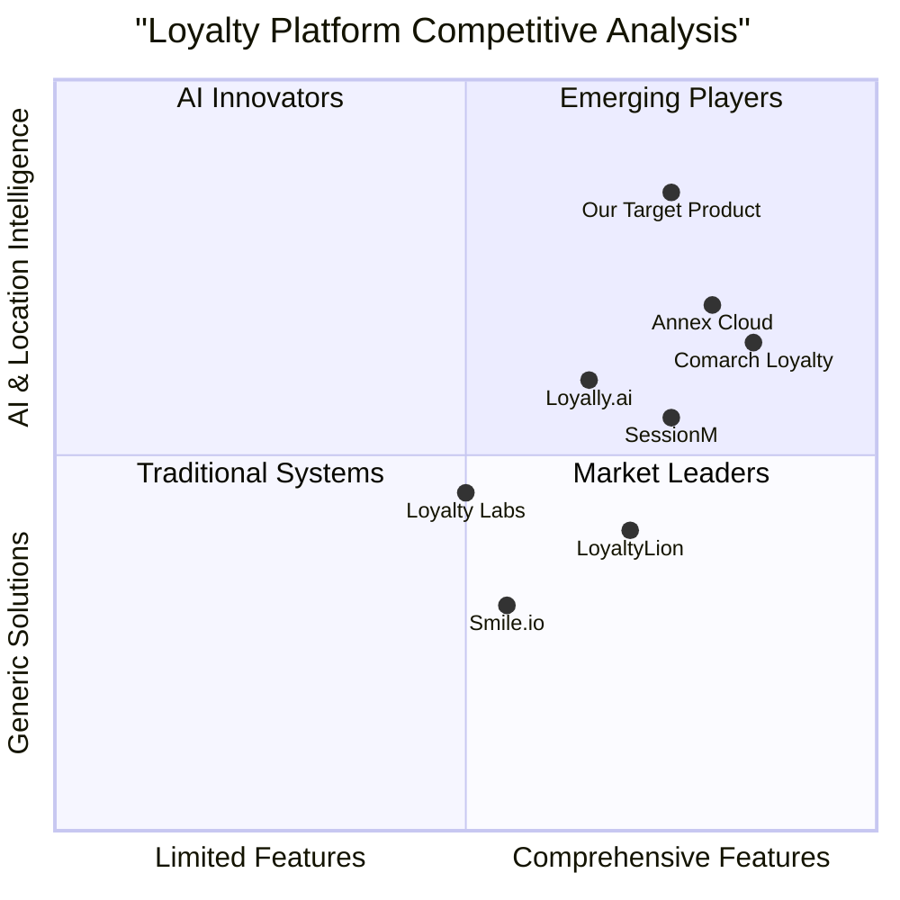
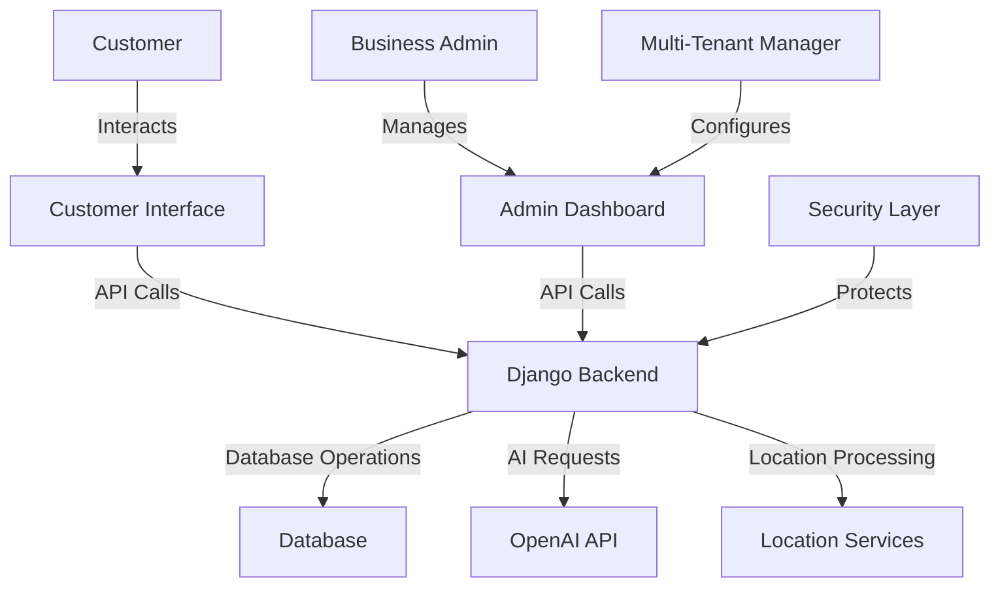

# Product Requirements Document (PRD)

# LoyaltyAI: AI-Driven Location-Based Multi-Tenant Loyalty System

## Language & Project Info
- **Language**: English
- **Programming Language**: Python (Django), TailwindCSS, TypeScript
- **Project Name**: loyalty_ai
- **Original Requirements**: Design and develop an AI-driven, location-based, multi-tenant Loyalty System that enables organizations across industries to create, manage, and scale intelligent customer engagement programs that drive retention, behavior-based insights, and personalized service delivery.

## Product Definition

### Product Goals

1. **Create a flexible loyalty engine** that supports configurable rules, multiple reward models, and location-based intelligence to drive customer engagement and retention.

2. **Leverage AI capabilities** to deliver personalized recommendations, predict customer behavior, detect churn risk, and provide actionable insights.

3. **Establish a multi-tenant platform** with robust admin tools that allows businesses across different industries to customize and manage their loyalty programs through a centralized dashboard.

### User Stories

#### As a Customer
1. As a customer, I want to earn points based on my purchases and location check-ins, so that I can receive rewards for my loyalty.
2. As a customer, I want to see my current point balance, tier status, and available rewards in a user-friendly interface, so that I can track my progress and benefits.
3. As a customer, I want to receive personalized offers based on my preferences and location, so that I can get maximum value from the loyalty program.
4. As a customer, I want to easily redeem my points for rewards through multiple channels, so that I can enjoy the benefits of my loyalty.
5. As a customer, I want to be notified about new rewards, point expirations, and tier upgrades, so that I can stay engaged with the program.

#### As a Business Admin
1. As a business admin, I want to configure custom rules for point earning and redemption, so that I can create a loyalty program tailored to my business needs.
2. As a business admin, I want to access AI-driven insights about customer behavior and program performance, so that I can make data-driven decisions.
3. As a business admin, I want to create and manage location-based promotions, so that I can drive foot traffic to specific locations.
4. As a business admin, I want to identify customers at risk of churning, so that I can take proactive retention measures.
5. As a business admin, I want to manually adjust customer points and rewards when necessary, so that I can provide customer service overrides.

### Competitive Analysis

#### 1. Loyally.ai
- **Pros**: 
  - User-friendly interface
  - Quick implementation
  - Good for small businesses
- **Cons**: 
  - Limited AI capabilities
  - Basic location features
  - Less customizable for enterprise needs

#### 2. Comarch Loyalty
- **Pros**: 
  - Enterprise-grade solution
  - Comprehensive reporting
  - Strong analytics
- **Cons**: 
  - Complex implementation
  - Less agile for hackathon-style deployment
  - Higher cost structure

#### 3. LoyaltyLion
- **Pros**: 
  - Strong e-commerce integration
  - Good API ecosystem
  - Solid point management
- **Cons**: 
  - Limited location intelligence
  - Basic AI features
  - Primarily focused on online businesses

#### 4. Smile.io
- **Pros**: 
  - Easy to implement
  - Versatile reward options
  - Good for SMBs
- **Cons**: 
  - Limited AI capabilities
  - Basic analytics
  - Limited location features

#### 5. Annex Cloud
- **Pros**: 
  - Omnichannel capabilities
  - Strong customization
  - Good enterprise features
- **Cons**: 
  - Complex setup
  - Less agile for rapid deployment
  - Higher implementation costs

#### 6. Loyalty Labs
- **Pros**: 
  - Custom development options
  - Good API flexibility
  - Solid reward management
- **Cons**: 
  - Less integrated AI
  - Basic location capabilities
  - Less automated insights

#### 7. SessionM
- **Pros**: 
  - Strong data management
  - Good segmentation tools
  - Solid enterprise integration
- **Cons**: 
  - Complex implementation
  - Less intuitive UI
  - Limited AI-driven personalization

## Technical Specifications

### Requirements Analysis

Our LoyaltyAI system will be built on Django, utilizing TailwindCSS for frontend styling, with a focus on creating a scalable, multi-tenant architecture. The system will leverage OpenAI's pre-trained models via the requests library to implement AI-driven features without requiring model training during the hackathon timeframe.

The core technical requirements are:

1. **Multi-Tenant Architecture**: Support for multiple businesses to configure and manage independent loyalty programs within a single platform.

2. **Loyalty Engine**: A flexible rule-based system that handles point accrual, redemption, tier progression, and location-based triggers.

3. **Customer Profiles**: Comprehensive customer data management with AI-powered segmentation and behavior tracking.

4. **Location Intelligence**: Integration of geospatial data for location-based rewards and engagement.

5. **AI Integration**: Utilizing OpenAI's models for personalization, churn prediction, and behavior analysis.

6. **Security Layer**: Robust authentication, encryption, and fraud prevention mechanisms.

7. **Admin Dashboard**: Comprehensive management tools for program configuration and monitoring.

8. **User Interface**: Engaging customer-facing interface for program participation.

### Requirements Pool

#### P0 (Must Have)
1. User authentication and authorization system with role-based access control
2. Multi-tenant data model that separates business configurations and customer data
3. Core loyalty engine with configurable rules for point earning and redemption
4. Customer profile management with point balance tracking
5. Admin dashboard for loyalty program configuration
6. Basic location check-in functionality
7. Integration with OpenAI for simple AI-powered features
8. User interface for customers to view and redeem rewards
9. Secure API endpoints with proper authentication
10. Basic fraud prevention mechanisms

#### P1 (Should Have)
1. Advanced rule configurations for complex loyalty scenarios
2. Customer segmentation based on AI analysis
3. Churn prediction and prevention recommendations
4. Location-based promotional targeting
5. Automated notifications for customers (points, rewards, tier changes)
6. Reporting and analytics dashboard
7. Tier-based loyalty program support
8. Multiple redemption channels for rewards
9. Referral tracking and rewards
10. Audit logging for security and compliance

#### P2 (Nice to Have)
1. Advanced AI-driven personalized offer generation
2. Predictive analytics for customer behavior
3. Natural language processing for feedback analysis
4. Gamification elements (badges, challenges)
5. Social media integration
6. Advanced fraud detection with machine learning
7. A/B testing for loyalty program rules
8. Customer journey visualization

### UI Design Draft

The user interface will consist of two main components:

#### 1. Customer-Facing Interface
- Modern, clean design using TailwindCSS
- Responsive layout for mobile and desktop
- Main sections:
  - Dashboard showing points, tier status, and quick actions
  - Rewards catalog with redemption options
  - Activity history with point transactions
  - Profile management
  - Location-based offers map view
  - Notification center

#### 2. Admin Dashboard
- Comprehensive management interface
- Main sections:
  - Program configuration (rules, rewards, tiers)
  - Customer management
  - Analytics and reporting
  - Location-based campaign management
  - AI insights panel
  - Security and audit controls
  - Multi-tenant management

### System Architecture

### Open Questions

1. **Integration Limitations**: What are the specific limitations of using the requests library for OpenAI integration during the hackathon?

2. **Data Privacy**: How should we handle location data privacy concerns and compliance requirements?

3. **Scalability**: What are the expected number of tenants and users during the hackathon demo?

4. **Fraud Prevention**: What specific fraud scenarios should we prioritize preventing?

5. **Performance**: What are the performance expectations for AI-driven recommendations and insights?

6. **Location Accuracy**: What level of location accuracy is required for the location-based features?

7. **Demo Data**: Will sample data be provided for the hackathon, or should we generate synthetic data?

8. **Time Constraints**: Given the hackathon timeframe, which features should be functional vs. simulated/mocked?

## Technical Implementation Details

### Core Technology Stack

- **Backend**: Django 5.0+
- **Frontend**: TailwindCSS, HTML, JavaScript/TypeScript
- **Database**: PostgreSQL (recommended) or SQLite for the prototype
- **AI Integration**: OpenAI API via requests library
- **Authentication**: Django authentication system with JWT
- **Location Services**: GeoDjango with PostGIS (if PostgreSQL is used)

### Data Models

#### Core Entities

1. **Tenant**
   - tenant_id
   - name
   - settings
   - subscription_type
   - active_status

2. **LoyaltyProgram**
   - program_id
   - tenant_id (FK)
   - name
   - description
   - rules_configuration
   - point_expiry_policy
   - created_at
   - updated_at

3. **Customer**
   - customer_id
   - tenant_id (FK)
   - user_id (FK)
   - profile_data
   - preferences
   - segment_tags
   - created_at

4. **LoyaltyAccount**
   - account_id
   - customer_id (FK)
   - points_balance
   - tier_status
   - lifetime_points
   - last_activity
   - created_at
   - updated_at

5. **Transaction**
   - transaction_id
   - loyalty_account_id (FK)
   - points
   - transaction_type (earn, redeem, expire, adjust)
   - description
   - location_data
   - timestamp
   - status

6. **Reward**
   - reward_id
   - program_id (FK)
   - name
   - description
   - point_cost
   - availability
   - redemption_instructions
   - created_at
   - updated_at

7. **Location**
   - location_id
   - tenant_id (FK)
   - name
   - address
   - coordinates
   - geofence_parameters
   - created_at
   - updated_at

8. **Rule**
   - rule_id
   - program_id (FK)
   - name
   - description
   - conditions (JSON)
   - actions (JSON)
   - priority
   - start_date
   - end_date
   - status

### API Endpoints

#### Customer API
- `/api/auth/` - Authentication endpoints
- `/api/profile/` - Customer profile management
- `/api/points/` - Points balance and history
- `/api/rewards/` - Available rewards
- `/api/transactions/` - Transaction history
- `/api/checkin/` - Location check-in
- `/api/recommendations/` - AI-powered recommendations

#### Admin API
- `/api/admin/programs/` - Loyalty program management
- `/api/admin/customers/` - Customer management
- `/api/admin/rules/` - Rules configuration
- `/api/admin/rewards/` - Rewards management
- `/api/admin/locations/` - Location management
- `/api/admin/analytics/` - Program analytics
- `/api/admin/insights/` - AI-driven insights

### AI Integration Points

1. **Customer Segmentation**
   - Analyze customer behavior and transaction history
   - Create dynamic segments based on behavior patterns
   - Endpoint: `/api/admin/insights/segments/`

2. **Churn Prediction**
   - Identify customers at risk of disengagement
   - Recommend retention strategies
   - Endpoint: `/api/admin/insights/churn/`

3. **Personalized Recommendations**
   - Generate personalized reward suggestions
   - Endpoint: `/api/recommendations/`

4. **Feedback Analysis**
   - Analyze customer feedback for sentiment and insights
   - Endpoint: `/api/admin/insights/feedback/`

5. **Location Intelligence**
   - Analyze location patterns and suggest targeted campaigns
   - Endpoint: `/api/admin/insights/locations/`

## Implementation Plan

### Phase 1: Foundation
- Set up Django project with TailwindCSS
- Implement multi-tenant data model
- Create basic authentication system
- Develop core loyalty engine logic
- Implement basic admin dashboard
- Set up customer profile management

### Phase 2: Core Features
- Develop points earning and redemption functionality
- Implement location check-in capabilities
- Create customer-facing UI for points and rewards
- Develop basic rule engine for loyalty configuration
- Set up OpenAI integration framework
- Implement basic security features

### Phase 3: AI and Advanced Features
- Integrate AI-powered recommendations
- Implement churn prediction
- Develop location-based campaign tools
- Add notification system
- Enhance security with fraud prevention
- Implement analytics dashboard

### Phase 4: Refinement and Testing
- User testing and UI refinement
- Performance optimization
- Security testing
- Demo preparation
- Documentation

## Success Metrics

1. **Functional Completeness**: All P0 requirements implemented and working
2. **User Experience**: Intuitive interface for both customers and admins
3. **Technical Performance**: System responsive under demo load
4. **AI Integration**: Successful integration with OpenAI for key features
5. **Innovation**: Creative use of location intelligence and AI
6. **Security**: Passes basic security review

## Conclusion

The LoyaltyAI system will provide a modern, flexible loyalty platform that leverages AI and location intelligence to deliver personalized experiences for customers and actionable insights for businesses. By focusing on a modular architecture with Django and integration with OpenAI, we can deliver a compelling hackathon prototype that demonstrates the potential of next-generation loyalty systems.